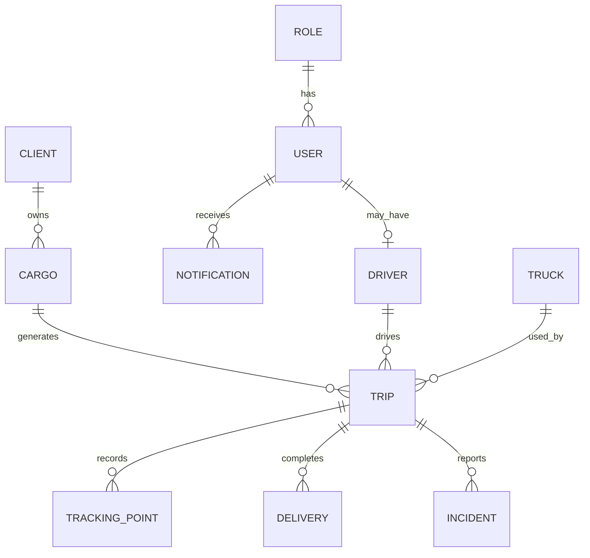
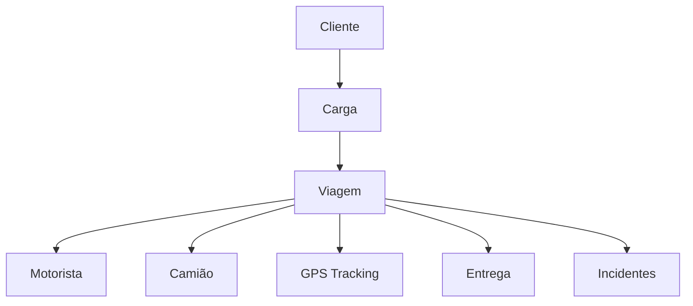
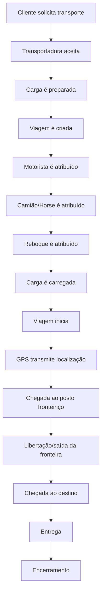
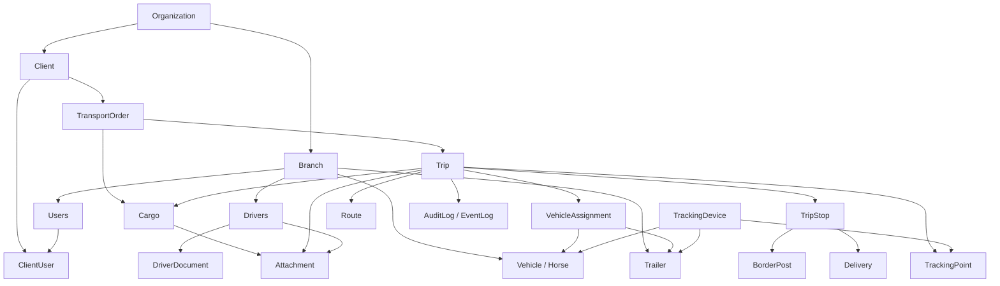
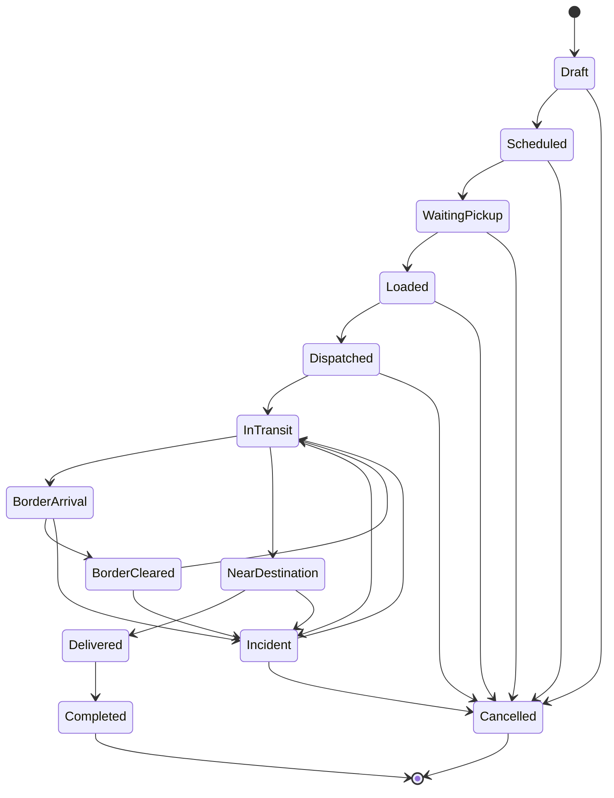

# 07 - Domain Refactoring Proposal

## 1. Introdução

O domínio atual representa uma base sólida para um MVP de gestão de transporte de cargas. Ele cobre os conceitos essenciais de cliente, carga, viagem, motorista, camião, rastreamento GPS, entrega, incidentes, notificações, utilizadores e permissões.

Contudo, a operação real da empresa é mais complexa do que o modelo atual. O processo observado envolve transporte internacional, gestão de reboques, passagem por postos fronteiriços, documentação de motoristas, histórico operacional, múltiplas atribuições de recursos e futura expansão para múltiplas empresas ou filiais.

A refatoração proposta tem três objetivos principais:

1. Alinhar o modelo de domínio ao processo operacional real.
2. Reduzir limitações estruturais antes que os CRUDs e aplicações cliente avancem demasiado.
3. Preparar a arquitetura para evoluir de um MVP para um Transportation Management System (TMS) completo.

Esta proposta não implementa alterações. Ela documenta decisões recomendadas, impactos, prioridades e uma estratégia incremental de migração.

## 2. Estado Atual

### Entidades existentes

| Entidade | Responsabilidade atual |
|---|---|
| Role | Representa perfis de acesso como ADMIN, DISPATCHER, DRIVER e CLIENT. |
| User | Representa utilizadores autenticáveis. |
| Client | Representa clientes comerciais. |
| Driver | Representa motoristas. |
| Truck | Representa camiões. Na prática, aproxima-se do conceito operacional de Horse. |
| Cargo | Representa carga a transportar. |
| Trip | Representa viagem associada a uma carga, um camião e um motorista. |
| TrackingPoint | Representa pontos GPS de uma viagem. |
| Delivery | Representa confirmação de entrega. |
| Incident | Representa incidentes operacionais. |
| Notification | Representa notificações por utilizador. |

### Relacionamentos atuais

### Limitações encontradas

| Limitação | Impacto |
|---|---|
| Trip obriga uma carga, um camião e um motorista. | Não suporta múltiplas cargas, troca de motorista ou múltiplos recursos. |
| Não existe Trailer. | A operação real não consegue controlar reboques. |
| Não existe BorderPost. | Não há suporte formal para passagem fronteiriça. |
| Não existe TransportOrder. | A solicitação do cliente fica misturada com a carga. |
| Não existe Organization ou Branch. | O sistema não está preparado para múltiplas empresas e filiais. |
| Estados são enums rígidos. | Fluxos operacionais mais ricos exigem histórico e transições controladas. |
| TrackingPoint não identifica dispositivo. | Dificulta integração com provedores GPS e auditoria de fonte. |
| Delivery não está ligada a paragens. | Não suporta múltiplos pontos de entrega. |
| Não há AuditLog ou EventLog. | Baixa rastreabilidade operacional e técnica. |

### Fluxo atual

### Arquitetura existente

A arquitetura atual está organizada em módulos NestJS, com controllers, services, repositories, DTOs e entidades por módulo. O acesso a dados é feito por Prisma. A API possui Swagger, JWT, guards de autenticação e permissões. O frontend administrativo usa Next.js e o app móvel usa Ionic Angular.

Essa estrutura é adequada para evolução incremental, desde que o domínio seja ajustado antes da expansão funcional.

## 3. Processo Operacional Real

O processo real observado pode ser descrito como:

Neste fluxo, a viagem não é apenas uma ligação entre carga, motorista e camião. Ela é uma operação coordenada com atribuições, documentos, localização, eventos, fronteiras, entregas e encerramento formal.

## 4. Comparação

| Processo atual | Processo esperado | Diferenças | Impacto | Prioridade |
|---|---|---|---|---|
| Cliente cria carga diretamente. | Cliente solicita transporte por uma ordem. | Falta TransportOrder. | Perde-se rastreabilidade comercial e operacional. | 🔴 Crítica |
| Trip possui cargoId obrigatório. | Uma viagem pode transportar uma ou várias cargas. | Falta relação N:N entre Trip e Cargo. | Limita consolidação de cargas. | 🔴 Crítica |
| Trip possui truckId obrigatório. | Viagem deve possuir cavalo/horse e reboque. | Falta Trailer e VehicleAssignment. | Operação real fica incompleta. | 🔴 Crítica |
| Trip possui driverId obrigatório. | Viagem pode trocar motorista ou ter motorista auxiliar. | Falta DriverAssignment. | Não suporta trocas em rota. | 🟠 Importante |
| GPS pertence diretamente à Trip. | GPS pode vir de dispositivo instalado em veículo/reboque. | Falta TrackingDevice. | Integrações GPS ficam frágeis. | 🟠 Importante |
| Não há postos fronteiriços. | Viagens internacionais passam por fronteiras. | Falta BorderPost e TripStop. | Não calcula tempo em fronteira. | 🔴 Crítica |
| Delivery confirma entrega final. | Pode haver múltiplas entregas/paragens. | Delivery deve relacionar-se a TripStop. | Limita operações multi-destino. | 🟠 Importante |
| Status é atualizado diretamente. | Estados devem obedecer transições e histórico. | Falta TripStatusHistory. | Baixa auditoria e risco de estados inválidos. | 🔴 Crítica |
| Permissões existem por role. | Permissões devem considerar organização, cliente e propriedade. | Falta escopo multi-tenant. | Risco de exposição de dados. | 🔴 Crítica |

## 5. Revisão do Domínio

| Entidade atual | Decisão | Justificativa |
|---|---|---|
| Role | Alterar | Manter conceito, mas avaliar permissões mais granulares e escopo por organização. |
| User | Alterar | Deve pertencer a Organization/Branch e poder representar utilizador interno, motorista ou cliente. |
| Client | Alterar | Deve relacionar-se a Organization e ClientUser para portal do cliente. |
| Driver | Alterar | Deve possuir documentos, validade de licença, passaporte e histórico de atribuições. |
| Truck | Dividir/renomear | O conceito operacional pode ser Horse; recomenda-se introduzir Vehicle com tipo. |
| Cargo | Alterar | Deve ligar-se a TransportOrder e suportar múltiplas viagens por relações explícitas. |
| Trip | Alterar profundamente | Deve deixar de conter diretamente apenas um cargo, um truck e um driver como estrutura fixa. |
| TrackingPoint | Alterar | Deve registrar dispositivo/fonte e, idealmente, snapshots técnicos. |
| Delivery | Alterar | Deve relacionar-se a TripStop e anexos. |
| Incident | Alterar | Deve ter severidade, status, anexos e eventos de resolução. |
| Notification | Manter | Adequada para MVP; futuramente integrar com Outbox. |

Nenhuma entidade atual precisa ser removida imediatamente. A recomendação é evoluir por composição, criando novas tabelas e migrando responsabilidades gradualmente.

## 6. Novas Entidades

| Entidade | Objetivo | Responsabilidade | Relacionamentos | Impacto |
|---|---|---|---|---|
| Organization | Suportar múltiplas empresas/transportadoras. | Isolar dados por empresa. | Possui Branches, Users, Clients, Vehicles, Trips. | 🔴 Alto |
| Branch | Suportar filiais. | Organizar operação por localidade. | Pertence a Organization; possui Users, Drivers, Vehicles. | 🟠 Médio |
| TransportOrder | Representar solicitação do cliente. | Separar pedido comercial da execução operacional. | Pertence a Client; gera Cargo e Trip. | 🔴 Alto |
| Vehicle | Generalizar frota. | Representar ativos móveis. | Pode ser Horse, Truck ou outro tipo. | 🟠 Médio |
| Horse | Representar cavalo mecânico. | Controlar placa, capacidade, status e documentos. | Pode ser especialização de Vehicle. | 🔴 Alto |
| Trailer | Representar reboque. | Controlar placa, capacidade, status e vínculo operacional. | Atribuído a Trip via VehicleAssignment. | 🔴 Alto |
| VehicleAssignment | Registrar uso de horse/trailer por viagem. | Controlar período, função e histórico de recursos. | Liga Trip a Vehicle/Trailer. | 🔴 Alto |
| TrackingDevice | Identificar fonte GPS. | Mapear dispositivo, provedor, veículo e status. | Liga-se a Vehicle/Trailer/Trip. | 🟠 Médio |
| BorderPost | Representar fronteiras. | Controlar país, nome, coordenadas e tempos. | Referenciado por TripStop. | 🔴 Alto |
| TripStop | Representar paragens operacionais. | Carga, fronteira, descarga, descanso, inspeção. | Pertence a Trip; pode referenciar BorderPost. | 🔴 Alto |
| Route | Representar rota planejada. | Definir origem, destino, distância, duração e fronteiras. | Usada por Trip; contém TripStops planejadas. | 🟠 Médio |
| Attachment | Armazenar comprovativos. | Fotos, documentos, assinaturas e ficheiros. | Liga-se a Driver, Trip, Cargo, Delivery, Incident. | 🟠 Médio |
| AuditLog | Registrar alterações. | Auditoria técnica e operacional. | Referencia entidade, utilizador e operação. | 🔴 Alto |
| DriverDocument | Controlar documentos do motorista. | Passaporte, carta, validade, anexos. | Pertence a Driver. | 🔴 Alto |
| CustomerPortal | Conceito de bounded context. | Expor visão segura ao cliente. | Usa ClientUser, TransportOrder, Tracking. | 🟠 Médio |
| ClientUser | Relacionar User a Client. | Permitir portal do cliente com isolamento. | Liga User a Client. | 🔴 Alto |
| TripStatusHistory | Registrar histórico de estados. | Controlar transições, datas e responsáveis. | Pertence a Trip. | 🔴 Alto |
| EventLog | Registrar eventos de domínio. | Base para integrações, notificações e outbox. | Gerado por operações de domínio. | 🟠 Médio |

## 7. Relações

### Modelo conceitual proposto

### Explicação dos relacionamentos

| Relacionamento | Explicação |
|---|---|
| Organization -> Branch | Uma empresa pode operar em várias filiais. |
| Branch -> Users/Drivers/Vehicles | Recursos operacionais pertencem a uma filial principal. |
| Client -> TransportOrder | O pedido de transporte nasce a partir de um cliente. |
| TransportOrder -> Cargo | Uma ordem pode gerar uma ou várias cargas. |
| TransportOrder -> Trip | A execução operacional pode ser vinculada à ordem. |
| Trip -> Cargo | Deve ser N:N para permitir múltiplas cargas por viagem. |
| Trip -> VehicleAssignment | Atribuições de horse, trailer e outros recursos ficam historizadas. |
| Trip -> TripStop | Cada evento físico relevante da viagem é uma paragem planejada ou real. |
| TripStop -> BorderPost | Paragens de fronteira referenciam posto fronteiriço. |
| TrackingDevice -> TrackingPoint | Cada ponto GPS deve ter fonte rastreável. |
| TripStop -> Delivery | Entrega passa a ser conclusão de uma paragem de destino. |
| Attachment -> entidades operacionais | Documentos e imagens devem ser reutilizáveis em vários contextos. |
| AuditLog/EventLog -> entidades | Toda mudança relevante deve ser auditável. |

## 8. Máquina de Estados

### Estados propostos

### Transições permitidas

| De | Para | Regra |
|---|---|---|
| Draft | Scheduled | Deve existir carga/ordem mínima e rota estimada. |
| Scheduled | WaitingPickup | Deve haver motorista e recursos atribuídos. |
| WaitingPickup | Loaded | Motorista confirma carregamento ou operação confirma loaded date. |
| Loaded | Dispatched | Expedição autoriza saída. |
| Dispatched | InTransit | Viagem inicia e primeira localização pode ser recebida. |
| InTransit | BorderArrival | GPS ou operador confirma chegada à fronteira. |
| BorderArrival | BorderCleared | Operador confirma liberação fronteiriça. |
| BorderCleared | InTransit | Viagem continua após fronteira. |
| InTransit | NearDestination | GPS detecta aproximação ou operador marca. |
| NearDestination | Delivered | Entrega confirmada com comprovativos. |
| Delivered | Completed | Operação encerra viagem após validação documental. |
| Qualquer não terminal | Cancelled | Requer motivo e responsável. |
| Estados operacionais | Incident | Incidente reportado. |
| Incident | InTransit | Incidente resolvido e viagem continua. |

### Validações recomendadas

| Validação | Motivo |
|---|---|
| Não iniciar viagem sem motorista, horse e trailer quando exigidos. | Evita operação incompleta. |
| Não confirmar fronteira sem BorderPost. | Garante métricas de fronteira. |
| Não entregar sem parada de destino. | Garante rastreabilidade de entrega. |
| Não concluir sem entrega ou motivo de encerramento. | Evita encerramento indevido. |
| Registrar cada transição em TripStatusHistory. | Auditoria e reconstrução de fluxo. |

## 9. Refatoração da API

### Endpoints atuais a manter temporariamente

| Endpoint | Decisão |
|---|---|
| `/auth/*` | Manter. |
| `/users/*` | Manter e adicionar escopo organizacional. |
| `/clients/*` | Manter. |
| `/drivers/*` | Manter e expandir documentos. |
| `/trucks/*` | Manter temporariamente; avaliar migração para `/vehicles`. |
| `/cargo/*` | Renomear futuramente para `/cargos`. |
| `/trips/*` | Manter, mas reduzir responsabilidade direta de assignments. |
| `/tracking/*` | Manter, mas vincular TrackingDevice. |
| `/delivery/*` | Migrar para subrecursos de TripStop/Trip. |
| `/incidents/*` | Manter e enriquecer. |

### Novos endpoints recomendados

| Endpoint proposto | Objetivo | Prioridade |
|---|---|---|
| `GET/POST /organizations` | Gestão multiempresa. | 🔴 |
| `GET/POST /branches` | Gestão de filiais. | 🟠 |
| `GET/POST /transport-orders` | Solicitações de transporte. | 🔴 |
| `GET/POST /vehicles` | Frota generalizada. | 🟠 |
| `GET/POST /trailers` | Gestão de reboques. | 🔴 |
| `POST /trips/:id/assignments` | Atribuir motorista, horse, trailer. | 🔴 |
| `GET /trips/:id/assignments` | Ver histórico de atribuições. | 🔴 |
| `GET/POST /border-posts` | Gestão de postos fronteiriços. | 🔴 |
| `GET/POST /routes` | Rotas planejadas. | 🟠 |
| `GET/POST /trips/:id/stops` | Paragens operacionais. | 🔴 |
| `PATCH /trips/:id/status` | Transição controlada de estado. | 🔴 |
| `GET /trips/:id/status-history` | Histórico de estados. | 🔴 |
| `POST /driver/trips/:id/pickup` | Operação específica do motorista. | 🔴 |
| `POST /driver/trips/:id/start` | Início da viagem pelo motorista. | 🔴 |
| `POST /driver/trips/:id/incidents` | Incidentes pelo motorista. | 🟠 |
| `GET /client/trips` | Portal cliente com escopo próprio. | 🔴 |
| `GET /client/trips/:id/tracking` | Tracking visível ao cliente. | 🔴 |
| `POST /attachments` | Upload de comprovativos. | 🟠 |

### Endpoints obsoletos ou a revisar

| Endpoint atual | Problema | Recomendação |
|---|---|---|
| `/cargo` | Singular inconsistente com REST e documentação. | Migrar para `/cargos` com compatibilidade temporária. |
| `/trips/:id/assign-driver` | Ação pontual sem histórico rico. | Substituir por `/trips/:id/assignments`. |
| `/trips/:id/assign-truck` | Não contempla trailer/horse. | Substituir por assignments. |
| `/delivery/trips/:tripId/pickup` | Pickup é evento/paragem da viagem. | Migrar para `/driver/trips/:id/pickup` ou `/trips/:id/stops/:stopId/complete`. |
| `/delivery/trips/:tripId/confirm` | Entrega deveria estar ligada ao destino/paragem. | Migrar para TripStop delivery. |

### Versionamento

Recomenda-se manter `/api/v1` para contratos atuais e introduzir mudanças de domínio em modo compatível. Caso a refatoração altere payloads de forma significativa, criar `/api/v2` apenas para recursos centrais como trips, orders e assignments.

## 10. Refatoração da Base de Dados

### Novas tabelas recomendadas

| Tabela | Prioridade | Observação |
|---|---|---|
| organizations | 🔴 | Base para multi-tenant. |
| branches | 🟠 | Filiais operacionais. |
| client_users | 🔴 | Portal cliente e isolamento. |
| transport_orders | 🔴 | Pedido do cliente antes da execução. |
| vehicles | 🟠 | Frota generalizada. |
| trailers | 🔴 | Reboques. |
| vehicle_assignments | 🔴 | Histórico de recursos por viagem. |
| trip_cargos | 🔴 | N:N entre viagens e cargas. |
| driver_assignments | 🟠 | Troca de motorista e auxiliares. |
| tracking_devices | 🟠 | Dispositivos GPS. |
| border_posts | 🔴 | Fronteiras. |
| routes | 🟠 | Rotas planejadas. |
| trip_stops | 🔴 | Paragens reais e planejadas. |
| attachments | 🟠 | Documentos e comprovativos. |
| audit_logs | 🔴 | Auditoria. |
| driver_documents | 🔴 | Passaporte, carta e validade. |
| trip_status_history | 🔴 | Histórico de estados. |
| event_logs | 🟠 | Eventos de domínio e integrações. |

### Campos adicionais recomendados

| Entidade | Campos |
|---|---|
| Driver | `passportNumber`, `passportExpiresAt`, `licenseExpiresAt`, `nationality`, `emergencyPhone`. |
| Cargo | `loadedAt`, `cargoType`, `packagingType`, `declaredValue`, `hazardous`. |
| Trip | `organizationId`, `branchId`, `routeId`, `plannedDepartureAt`, `dispatchedAt`, `completedAt`, `cancelledAt`, `cancelReason`. |
| TrackingPoint | `trackingDeviceId`, `source`, `odometer`, `ignition`, `batteryLevel`, `signalQuality`. |
| Incident | `severity`, `status`, `resolvedById`, `resolutionNotes`. |
| Delivery | `tripStopId`, `proofAttachmentId`, `receivedByPhone`. |

### Índices recomendados

| Índice | Motivo |
|---|---|
| `organizationId` em entidades principais | Isolamento e performance multi-tenant. |
| `branchId` em recursos operacionais | Filtros por filial. |
| `tripId, recordedAt` em TrackingPoint | Consultas de rota e histórico GPS. |
| `tripId, status, changedAt` em TripStatusHistory | Timeline operacional. |
| `tripId, stopType, plannedAt` em TripStop | Planeamento e execução. |
| `borderPostId, arrivedAt, clearedAt` em TripStop | Métricas de fronteira. |
| `driverId, documentType` em DriverDocument | Validação documental. |
| `vehicleId, assignedFrom, assignedTo` em VehicleAssignment | Conflitos de agenda. |

### Enums e tabelas configuráveis

Estados operacionais críticos podem começar como enums, mas devem ser desenhados para migração futura para tabelas configuráveis:

| Conceito | Recomendação |
|---|---|
| TripStatus | Tabela configurável ou enum + history no curto prazo. |
| IncidentType | Tabela configurável no médio prazo. |
| StopType | Enum inicial aceitável. |
| DocumentType | Enum inicial aceitável. |
| VehicleType | Enum inicial aceitável. |

## 11. Compatibilidade

A migração deve ser incremental e sem perda de dados.

### Estratégia recomendada

1. Criar novas tabelas sem remover campos atuais.
2. Popular novas tabelas a partir dos dados existentes.
3. Manter endpoints atuais funcionando.
4. Criar endpoints novos em paralelo.
5. Ajustar frontend e mobile gradualmente.
6. Após estabilização, marcar endpoints antigos como deprecated.
7. Remover campos obsoletos apenas em versão futura.

### Mapeamento inicial de dados

| Atual | Novo |
|---|---|
| Client | Client vinculado a Organization padrão. |
| User | User vinculado a Organization/Branch padrão. |
| Truck | Vehicle ou Horse inicial. |
| Trip.cargoId | Registro em TripCargo. |
| Trip.driverId | Registro em DriverAssignment. |
| Trip.truckId | Registro em VehicleAssignment. |
| Cargo.pickupDate | TripStop ou Cargo.loadedAt, conforme regra final. |
| Delivery | Delivery vinculada a TripStop destino criado automaticamente. |

## 12. Roadmap de Refatoração

### Fase 1 - Mudanças sem impacto

| Ação | Resultado |
|---|---|
| Documentar domínio alvo. | Alinhamento técnico e de negócio. |
| Definir linguagem ubíqua. | Redução de ambiguidades entre cargo, trip, horse e trailer. |
| Padronizar nomenclatura REST planejada. | Evita contratos contraditórios. |
| Criar ADRs de multi-tenant e estados. | Base para decisões futuras. |

### Fase 2 - Novas entidades

| Ação | Resultado |
|---|---|
| Adicionar Organization, Branch, Trailer, BorderPost. | Suporte ao processo real. |
| Adicionar DriverDocument. | Controle documental. |
| Adicionar Attachment. | Comprovativos operacionais. |

### Fase 3 - Refatoração de viagens

| Ação | Resultado |
|---|---|
| Criar TripCargo, VehicleAssignment, DriverAssignment. | Viagens flexíveis. |
| Criar TripStop e TripStatusHistory. | Fluxo auditável. |
| Migrar assign-driver/truck para assignments. | Histórico operacional consistente. |

### Fase 4 - Refatoração GPS

| Ação | Resultado |
|---|---|
| Criar TrackingDevice. | Integração com provedores GPS. |
| Relacionar TrackingPoint à fonte. | Maior rastreabilidade. |
| Validar permissões no WebSocket. | Tracking seguro por cliente/viagem. |

### Fase 5 - Portal Cliente

| Ação | Resultado |
|---|---|
| Criar ClientUser. | Acesso seguro do cliente. |
| Criar endpoints `/client/*`. | Visão própria de cargas, viagens e tracking. |
| Aplicar escopo por cliente. | Redução de risco de exposição de dados. |

### Fase 6 - App Motorista

| Ação | Resultado |
|---|---|
| Criar endpoints `/driver/*`. | Fluxo operacional próprio do motorista. |
| Implementar pickup, start, border, incident, delivery. | App aderente à operação real. |
| Validar documentos antes de atribuição. | Redução de risco operacional. |

## 13. Análise de Impacto

| Alteração | Prioridade | Complexidade | Tempo estimado | Risco | Benefício |
|---|---|---|---|---|---|
| Organization/Branch | 🔴 Crítica | Alta | Médio | Médio | Prepara multiempresa e filiais. |
| Trailer | 🔴 Crítica | Média | Curto | Baixo | Alinha com planilha operacional. |
| BorderPost/TripStop | 🔴 Crítica | Alta | Médio | Médio | Suporta transporte internacional. |
| TripStatusHistory | 🔴 Crítica | Média | Curto | Baixo | Auditoria e controle de fluxo. |
| TripCargo N:N | 🔴 Crítica | Alta | Médio | Médio | Suporta múltiplas cargas por viagem. |
| VehicleAssignment | 🔴 Crítica | Alta | Médio | Médio | Histórico de recursos e conflitos. |
| DriverDocument | 🔴 Crítica | Média | Curto | Baixo | Suporta passaporte e carta. |
| ClientUser | 🔴 Crítica | Média | Curto | Médio | Portal cliente seguro. |
| TrackingDevice | 🟠 Importante | Média | Curto | Médio | Integração GPS robusta. |
| Attachment | 🟠 Importante | Média | Curto | Baixo | Comprovativos e documentos. |
| Route | 🟠 Importante | Média | Médio | Baixo | Planeamento e métricas. |
| EventLog/Outbox | 🟠 Importante | Alta | Médio | Médio | Notificações e integrações confiáveis. |
| Event Sourcing completo | 🟢 Opcional | Muito alta | Longo | Alto | Útil apenas se auditoria total for requisito central. |

## 14. Recomendações Arquiteturais

### DDD

Recomenda-se organizar o domínio em bounded contexts:

| Contexto | Responsabilidade |
|---|---|
| Identity & Access | Utilizadores, roles, permissões e autenticação. |
| Customer Management | Clientes e utilizadores do portal. |
| Fleet Management | Vehicles, horses, trailers, tracking devices. |
| Transport Operations | Transport orders, cargo, trips, assignments, stops. |
| Tracking | Pontos GPS, rotas, localização em tempo real. |
| Delivery & Proof | Entregas, assinaturas, fotos e anexos. |
| Incident Management | Incidentes e resoluções. |
| Notifications | Notificações e comunicação assíncrona. |

### Clean Architecture

A estrutura atual já separa controllers, services e repositories. A próxima evolução deve reforçar:

1. Casos de uso explícitos para operações críticas.
2. Entidades de domínio com regras de transição.
3. Repositories como abstração de persistência, sem espalhar regras no Prisma.
4. DTOs separados de entidades de domínio.

### Repository Pattern

Manter o padrão atual, mas evitar que repositories concentrem lógica de negócio. Repositories devem persistir e consultar. Regras como "pode iniciar viagem" ou "pode atribuir trailer" devem viver em services de domínio ou use cases.

### CQRS

CQRS faz sentido parcialmente:

| Área | Recomendação |
|---|---|
| Operações transacionais | Commands/use cases. |
| Dashboard e relatórios | Queries otimizadas. |
| Tracking em tempo real | Queries específicas e cache no futuro. |

Não é necessário introduzir CQRS completo de imediato.

### Domain Events

Recomenda-se publicar eventos de domínio para:

| Evento | Uso |
|---|---|
| TripScheduled | Notificar motorista/operação. |
| VehicleAssigned | Atualizar disponibilidade. |
| CargoLoaded | Atualizar estado e cliente. |
| TripDispatched | Iniciar acompanhamento. |
| BorderArrived | Medir tempo de fronteira. |
| BorderCleared | Continuar fluxo. |
| DeliveryConfirmed | Encerrar entrega e notificar cliente. |
| IncidentReported | Alertas e SLA. |

### Outbox Pattern

Recomendado no médio prazo para garantir que notificações, WebSocket, e-mails e futuras integrações externas sejam emitidas com consistência transacional.

### Event Sourcing

Não é recomendado como base neste momento. O custo operacional é alto. A combinação `TripStatusHistory`, `AuditLog` e `EventLog` oferece rastreabilidade suficiente para a fase atual.

### Multi-tenant

Multi-tenant deve ser preparado desde cedo com `organizationId` nas entidades principais. Mesmo que exista apenas uma empresa no início, essa decisão evita refatoração profunda no futuro.

### Permissões

Além de roles, o sistema deve validar escopo:

| Perfil | Escopo |
|---|---|
| ADMIN | Organização inteira ou global, conforme produto. |
| DISPATCHER | Organização/filial. |
| DRIVER | Apenas viagens atribuídas. |
| CLIENT | Apenas dados dos seus clientes vinculados. |

### Escalabilidade

Recomendações:

1. Índices por `organizationId`, `tripId`, `recordedAt` e status.
2. Separar queries de dashboard das queries transacionais.
3. Considerar retenção ou particionamento futuro de TrackingPoint.
4. Usar jobs assíncronos para notificações e integrações.
5. Validar autorização também em WebSocket.

## 15. Conclusão

O domínio atual não suporta completamente a operação real da empresa. Ele suporta um MVP interno de transporte de cargas, mas ainda não cobre requisitos essenciais de um TMS internacional: reboques, fronteiras, documentos, múltiplas atribuições, histórico operacional, portal cliente seguro e multiempresa.

### Mudanças obrigatórias antes de continuar os CRUDs

1. Definir Organization/Branch e estratégia multi-tenant.
2. Introduzir Trailer.
3. Introduzir BorderPost e TripStop.
4. Introduzir TripStatusHistory.
5. Refatorar Trip para não depender rigidamente de um cargo, um camião e um motorista.
6. Definir endpoints próprios para motorista e cliente.
7. Alinhar nomenclatura REST, especialmente `/cargo` versus `/cargos`.

### Mudanças que podem ficar para versões futuras

1. Route avançado com otimização.
2. Outbox completo.
3. CQRS formal.
4. Event sourcing.
5. Particionamento de tracking.
6. Integrações externas com provedores GPS.

### Arquitetura recomendada

A arquitetura recomendada é uma evolução incremental da base atual:

1. Manter NestJS modular, Prisma, JWT e Swagger.
2. Reforçar DDD com bounded contexts e linguagem ubíqua.
3. Introduzir entidades operacionais ausentes antes de expandir funcionalidades.
4. Criar histórico de estados e eventos de domínio.
5. Preparar multi-tenant desde já.
6. Evoluir API por compatibilidade, evitando quebras abruptas.

Com essas mudanças, o sistema deixa de ser apenas um MVP de gestão de cargas e passa a ter fundação para evoluir para um Transportation Management System completo, capaz de representar a operação internacional real da empresa.
