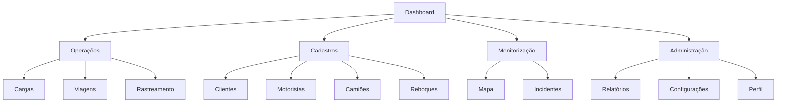
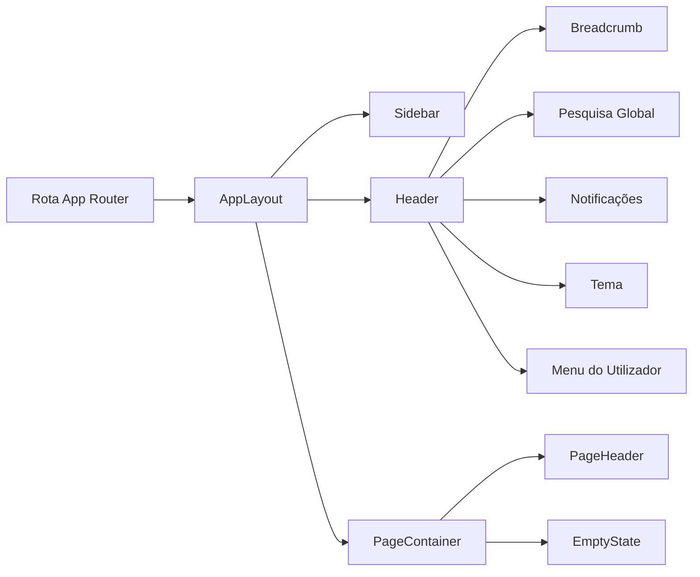

# 01 - Application Shell

## Objetivo

Esta sprint cria a infraestrutura visual do Frontend Administrativo. O objetivo é disponibilizar um shell reutilizável para todas as páginas do sistema, sem implementar regras de negócio, CRUDs, formulários, consumo de API ou dados mockados.

## Estrutura

```text
apps/web/
  app/
    page.tsx
    clientes/page.tsx
    motoristas/page.tsx
    camioes/page.tsx
    reboques/page.tsx
    cargas/page.tsx
    viagens/page.tsx
    rastreamento/page.tsx
    mapa/page.tsx
    incidentes/page.tsx
    relatorios/page.tsx
    configuracoes/page.tsx
    perfil/page.tsx
  src/
    shared/
      components/
      hooks/
      layout/
      navigation/
      providers/
      services/
      types/
      utils/
```

## Layouts

| Componente | Responsabilidade |
|---|---|
| `AppLayout` | Shell principal com sidebar, header, conteúdo e footer. |
| `Sidebar` | Navegação desktop recolhível, logo e grupos de menu. |
| `MobileDrawer` | Menu lateral em mobile/tablet. |
| `Header` | Breadcrumb, pesquisa global, notificações, tema e utilizador. |
| `Breadcrumb` | Trilho automático baseado na rota atual. |
| `PageContainer` | Limita largura e define espaçamento padrão das páginas. |
| `ContentArea` | Área semântica principal. |
| `Footer` | Rodapé compacto do shell. |

## Componentes Globais

| Componente | Estado atual |
|---|---|
| `PageHeader` | Título, descrição e área para ações. |
| `Card` | Superfície padrão para conteúdo. |
| `StatsCard` | Estrutura de indicador, sem dados conectados. |
| `Section` | Agrupamento semântico de conteúdo. |
| `PageLoader` | Estado de carregamento de página. |
| `LoadingOverlay` | Overlay de processamento. |
| `EmptyState` | Estado vazio e mensagem "Em desenvolvimento". |
| `ErrorState` | Estado de erro estrutural. |
| `ConfirmDialog` | Diálogo de confirmação visual. |
| `StatusBadge` | Badge visual de estado. |
| `SearchInput` | Campo de pesquisa reutilizável. |
| `ActionButton` | Botão base para ações. |
| `PrimaryButton` | Variante primária. |
| `SecondaryButton` | Variante secundária. |
| `IconButton` | Botão quadrado com ícone. |
| `DataTable` | Estrutura de tabela, sem integração de dados. |
| `Pagination` | Estrutura visual de paginação. |
| `FilterBar` | Estrutura visual de filtros. |

## Navegação



Rotas criadas:

| Rota | Página |
|---|---|
| `/` | Dashboard |
| `/clientes` | Clientes |
| `/motoristas` | Motoristas |
| `/camioes` | Camiões |
| `/reboques` | Reboques |
| `/cargas` | Cargas |
| `/viagens` | Viagens |
| `/rastreamento` | Rastreamento |
| `/mapa` | Mapa |
| `/incidentes` | Incidentes |
| `/relatorios` | Relatórios |
| `/configuracoes` | Configurações |
| `/perfil` | Perfil |

## Fluxo



## Responsividade

| Viewport | Comportamento |
|---|---|
| Desktop | Sidebar fixa e recolhível. |
| Tablet | Header preservado e menu via drawer. |
| Mobile | Sidebar oculta, botão de menu no header e drawer lateral. |

## Regras Aplicadas

1. Não há consumo de APIs nas páginas do shell.
2. Não há dados mockados.
3. Não há CRUDs.
4. Não há formulários de negócio.
5. Componentes interativos são client components apenas quando necessário.
6. O restante permanece como server component sempre que possível.
7. Tailwind CSS é usado para todo o styling.
8. Ícones usam `lucide-react`.

## Próximas Sprints

1. Ligar autenticação ao shell.
2. Implementar dashboard real.
3. Criar CRUDs por módulo.
4. Integrar API.
5. Ativar permissões por perfil.
6. Evoluir tabela, filtros e paginação com dados reais.
