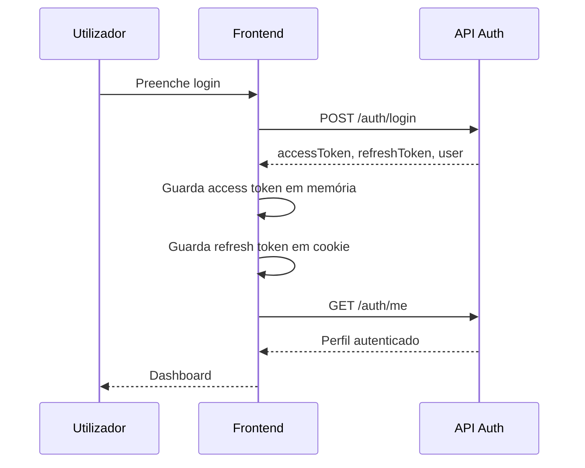

# 02 - Authentication

## Objetivo

Implementar autenticação real no Frontend Administrativo usando os endpoints existentes do backend NestJS:

- `POST /api/v1/auth/login`
- `POST /api/v1/auth/refresh`
- `POST /api/v1/auth/logout`
- `GET /api/v1/auth/me`
- `PATCH /api/v1/auth/password`

Não existem dados mockados nem autenticação falsa nesta camada.

## Fluxo



## Estratégia de Sessão

| Item | Estratégia |
|---|---|
| Access Token | Mantido apenas em memória. |
| Refresh Token | Guardado em cookie `sgrtc_refresh_token` para suportar reload e middleware. |
| Dados mínimos do utilizador | Guardados em `sessionStorage`. |
| Password | Nunca é guardada. |

O backend atual devolve tokens no corpo da resposta e não define cookies HTTP-only. Por isso, o frontend não consegue criar um cookie HTTP-only. A solução atual evita `localStorage` para o access token e mantém o refresh token em cookie `SameSite=Lax`. Para segurança superior, recomenda-se futuramente migrar para cookies HTTP-only definidos pelo backend ou por um BFF.

## Providers

| Provider | Responsabilidade |
|---|---|
| `AuthProvider` | Estado de sessão, utilizador, login, logout, refresh, permissões e troca de password. |
| `AppProviders` | Compõe tema, React Query, toast e autenticação. |

## API Client

O cliente Axios fica em:

```text
apps/web/src/shared/services/api-client.ts
```

Responsabilidades:

1. `baseURL` configurável por `NEXT_PUBLIC_API_URL` ou `NEXT_PUBLIC_API_BASE_URL`.
2. Timeout de 15 segundos.
3. Header `Authorization: Bearer` com access token em memória.
4. Interceptor de resposta para `401`.
5. Renovação automática via `POST /auth/refresh`.
6. Retry da requisição original após refresh.
7. Logout automático quando refresh falha.
8. Normalização de mensagens de erro.

## Auth Service

```text
apps/web/src/shared/services/auth.service.ts
```

| Função | Endpoint |
|---|---|
| `login()` | `POST /auth/login` |
| `refresh()` | `POST /auth/refresh` |
| `logout()` | `POST /auth/logout` |
| `me()` | `GET /auth/me` |
| `changePassword()` | `PATCH /auth/password` |

## Hooks

| Hook | Uso |
|---|---|
| `useAuth()` | Acesso completo à sessão. |
| `useCurrentUser()` | Utilizador atual e loading. |
| `usePermissions()` | Permissões, role e helpers. |
| `useHasPermission()` | Verifica uma permissão específica. |

## Guards

| Componente | Responsabilidade |
|---|---|
| `ProtectedRoute` | Bloqueia páginas privadas e redireciona para `/login`. |
| `ProtectedLayout` | Combina `ProtectedRoute` + `AppLayout`. |
| `PermissionGuard` | Renderiza conteúdo apenas com permissão específica. |
| `RoleGuard` | Renderiza conteúdo apenas para roles permitidas. |

## Proxy

O proxy Next.js fica em:

```text
apps/web/proxy.ts
```

Regras:

| Condição | Ação |
|---|---|
| Sem refresh token e rota privada | Redireciona para `/login`. |
| Com refresh token e rota `/login` | Redireciona para `/`. |
| Rota pública `/login` sem sessão | Permite acesso. |

## Rotas

| Tipo | Rotas |
|---|---|
| Pública | `/login` |
| Privadas | Todas as restantes rotas administrativas |

## Login

Componente:

```text
apps/web/src/shared/components/login-form.tsx
```

Campos:

- Email
- Password
- Remember me
- Esqueci a password
- Botão Entrar

Recursos:

1. Validação com `zod` e `react-hook-form`.
2. Loading no botão.
3. Mensagens de erro da API.
4. Toast de sucesso/erro.
5. Redirecionamento para `next` ou dashboard.

## Perfil

Rota:

```text
/perfil
```

Componente:

```text
apps/web/src/shared/components/profile-view.tsx
```

Consome:

- `GET /auth/me`
- `PATCH /auth/password`

Apresenta:

- Nome
- Email
- Perfil/role
- Último login
- Estado
- Permissões
- Formulário de alteração de password

## Componentes

| Componente | Estado |
|---|---|
| `LoginForm` | Implementado. |
| `UserMenu` | Integrado com utilizador real e logout. |
| `UserAvatar` | Implementado. |
| `PermissionGuard` | Implementado. |
| `ProtectedLayout` | Implementado. |
| `UnauthorizedPage` | Implementado. |
| `SessionExpiredDialog` | Implementado. |

## Permissões

As permissões vêm do backend no login/refresh/me. O frontend não calcula permissões; apenas consome e verifica:

```ts
hasPermission("trips:manage")
hasRole(["ADMIN", "DISPATCHER"])
```

## UX

| Caso | Comportamento |
|---|---|
| Loading inicial | Mostra validação de sessão. |
| Login inválido | Mostra erro e toast. |
| Refresh automático | Transparente para o utilizador. |
| Refresh falhou | Limpa sessão, mostra diálogo e redireciona para login. |
| Logout | Chama API e limpa sessão local. |
| Alterar password | Valida formulário e mostra feedback. |

## Segurança

1. Access token não é persistido em `localStorage`.
2. Password nunca é persistida.
3. Refresh token é removido no logout ou expiração.
4. Requisições privadas usam Bearer token.
5. Rotas privadas são protegidas no middleware e no cliente.
6. Permissões são fornecidas pelo backend.

## Limitação Atual

Como o backend não define cookies HTTP-only, o refresh token fica em cookie criado pelo frontend. Esta abordagem cumpre a restrição de não persistir o access token em `localStorage`, mas não substitui a proteção de cookies HTTP-only. A evolução recomendada é ajustar o backend para emitir cookies seguros ou introduzir uma camada BFF.
